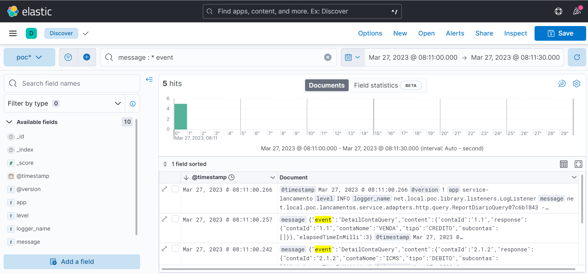

# Desafio ACT Digital Carrefour

Este projeto usa vários Patterns em conjunto para a solução porposta, tais como: Command-Query Responsibility Segregation (CQRS), Arquitetura Hexagonal e Event Sourcing. 

Foi incluída uma integração com a stack ELK (Elastic Search, Logstash e Kibana), para melhor observar o ambiente e seus componentes.

Foi usado o banco de dados H2 para armazenar os dados, sendo que cada microsserviço possui sua base em separado e a integração se dá por meio de chamadas REST entre eles.

Para elucidar melhor o modelo de dados que foi adotado, disponho abaixo uma imagem de como ficaria o modelo físico de banco de dados (caso fosse adotado).

## Estrutura do Projeto

O Projeto está dividido em três principais componentes:

    - Command: Responsável por processar todas as intenções de mudanças nos dados do projeto, tais como: incluir, alterar, excluir, etc...
    - Query: Responsável por processar todas as pesquisas feitas no sistema provendo um modelo "readonly".
    - ServiceBus: Este componente fica responsável por prover de forma "lazy load" todos os componentes envolvidos no processo de leitura/gravação além de disparar eventos que podem ser utilizados para logging ou outros fatores inerentes ao negócio.

Todos estes componentes foram encapsulados em uma biblioteca a fim de manter a reusabilidade e evitar repetição no código.

## Iniciando o projeto

Seguindo as instruções abaixo você terá uma cópia do projeto sendo executada em sua máquina local para efeitos de teste.

## Pré-requisito

  - Docker
  - Java 11 ou mais novo
  - Maven 3.6.0 mais novo

## Instalação

   - Clone o repositório: git clone https://github.com/mmendespro/desafio-act-carrefour.git
   - Navegue até a pasta do projeto: cd desafio-act-carrefour
   - Navegue até a pasta docker e suba os containers da stack ELK: docker-compose up -d 
   - Construa o projeto desejado: mvn clean install
   - Execute o projeto desejado: mvn spring-boot:run ou utilize o script "build-project.sh"
   - Import no Postman a collection e com todos os serviços em execução execute as chamadas.
   - Acesse o Kibana em "http://localhost:5601" clique em discover e caso ainda não tenha criado um índice o Kibana soliciará que o faça, sugiro o pattern "poc-*", e por fim veja o gráfico abaixo com os eventos e logs agregados da aplicação.

## Criado com

    - Elastic Search, Logstash, Kibana
    - Spring Boot Framework
    - Maven Dependency Management
